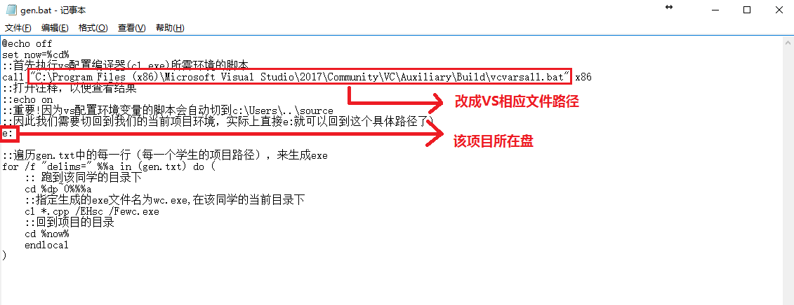
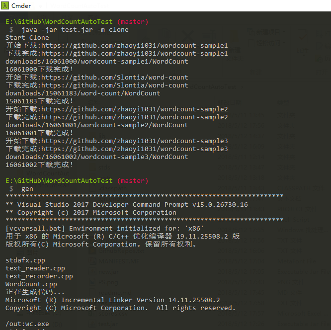
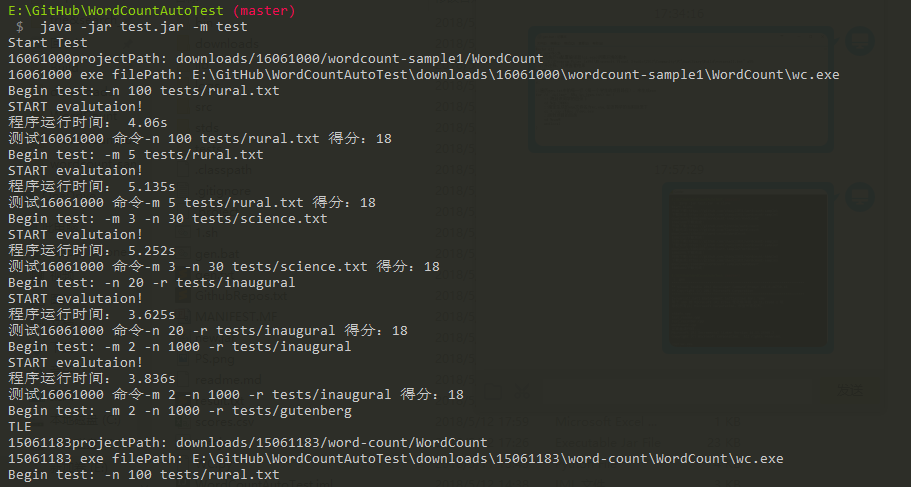

# Usages:

## 需要配置的文件



## 使用流程

1. 执行java -jar test.jar -m clone clone
    来下载作业链接。默认使用的是当前路径下的GithubRepo.txt，如果要指定这个文件，可以加上-g [gitFile]。这个步骤将产生gen.txt, 即每个学生的项目在本地的相对路径。
2. 打开gen.bat，或者执行gen或gen.bat
    为每个项目编译生成exe
3. 执行java -jar test.jar -m test
    开始测试，其后可以加上-l [timeLimit]，默认时限是3秒

## 下载Github对应仓库

命令行: java jar test.jar -g(--grab) [git file] -gi(--grabId) [student id]

*尚未支持-gi,请先使用-g*

* 本功能能用于从学生对应的GitHub仓库中Clone其作业到文件夹Projects下。
* 文件[git file] 提供学号与GitHub仓库的对应关系，多行分开。每行的格式为16061000 https://github.com/WordCount【分割符是空格】
* ~~学号\[number id\](可选参数)提供单个同学的学号，代表仅对该同学的作业进行Clone~~


## 自动评测时间点时长

命令行：java -jar test.jar -l(--limit) [max limit second] -ti(--testId)[studentId]

*尚未支持-ti,请先不使用此功能*

* 本功能用于给学生的作业进行评分，并记录每份作业在不同测试数下的得分、时间。
* 数字[limit second]指定效率测试运行的最大时长，默认是60秒。
* ~~学号\[number id\](可选参数)提供单个同学的学号，代表仅对该同学的作业进行测试评分~~

具体的测试细节与描述均在logs/(学号)-log.txt可以查看，方便追查错误信息。

## 结果说明

如图:




## 环境配置

Windows10
Visuo Studio2017
Jdk1.8

## 文件说明
    
    
```
project
│   readme.md
│   WC.py提供的python版本的标程。可以对该文件进行命令行参数的测试，即-r -m -n等测试
│   GithubRepos.txt 预先填好的文件，存放学号与GitHub作业url对应关系
│   test.jar 存放使用测试的jar包
│   gen.txt 存放每名同学的项目的相对路径，由-m clone产生
│   gen.bat 生成exe的批处理脚本
│   scores.csv **最终的得分文件，可以用excel直接查看**
|   
└───tests/ 存放测试的文件，目前主要包括从Python中nltk库下载的几个数据文件)
│   │   rural.txt
│   │   science.txt
│   │   result_standard.txt 
│   
└───stds/ 存放标程生成的result文件(目前是用[刘畅同学](https://github.com/slontia/word-count)生成的答案作为结果)
│   │   std1.txt 测试用例1的结果文件
│   │   std2.txt
│   │   std3.txt
│   
└───logs/ 存放每个同学的测试的输出文件
|   │   16061000
|       |   result1.txt
|       |   result2.txt
|       |   ...txt
|   │   16061002
│   
└───downloads/ 存放每个作业仓库
|   └───16061000/
|       |   WOrdCount/
|   └───16061001/
|       |   WOrdCount/
|   
└───lib/ java依赖包
└───src/ java源代码
   
```

